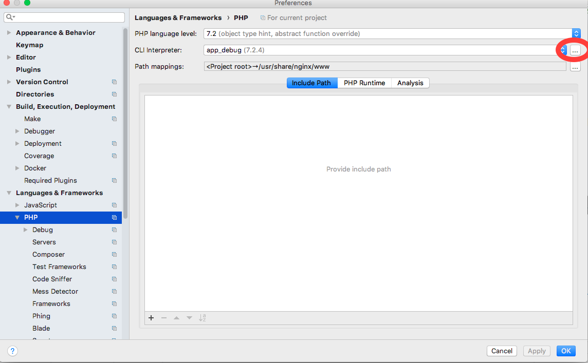
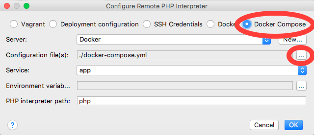
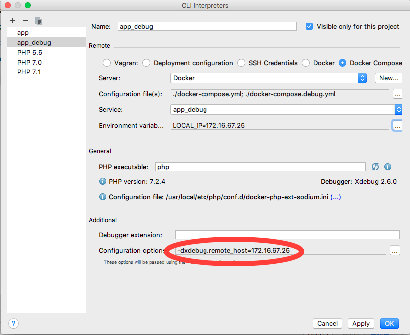
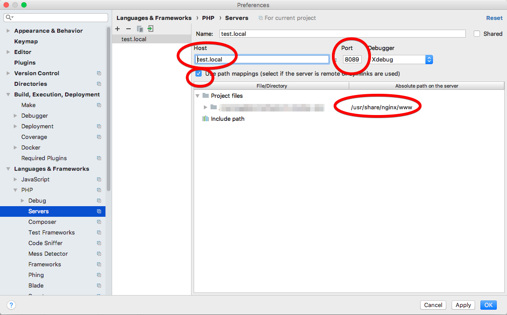
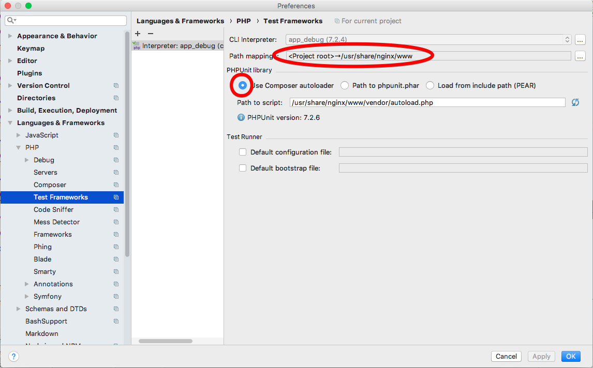

# How to set up the PHPStorm environment for Docker and XDebug

## Preparing the code

The following steps explain the general setup of a Docker-based development environment where XDebug is optional. Your own projects should follow a similar approach.

The example code of this project already has all the necessary changes.

### Dockerfile
The first step for optionally adding XDebug to your setup is to change your [`Dockerfile`](../env/Dockerfile) to use a [multi-stage build approach](https://docs.docker.com/develop/develop-images/multistage-build/). The first stage configures/installs the PHP environment, the second stage installs XDebug via PECL.

**Note:** Multi-stage builds need Docker 17.05 or higher. Check your Docker version.

### docker-compose.yml
The file [`docker-compose.yml`](../docker-compose.yml) contains the development environment, in our case a web server and the PHP environment, built from the Dockerfile. To avoid "baking in" XDebug when building the PHP environment, you need to add the `target` parameter to the build information. The value must be the name of the first build stage of your Dockerfile.

**Note:** The `target` parameter is available from docker-compose version 3.4 onwards. Make sure that the version at the top of your `docker-compose.yml` file is correct. If you use docker-compose with Travis CI, make sure that the [Travis environment supports your Docker and docker-compose version](https://docs.travis-ci.com/user/docker/).

**Note:** While PHP-FPM and XDebug seem to use the same port by default (9000), those ports actually have different end points and will not interfere. XDebug sends its debug information from PHP-FPM to the *host machine* (where PHPStorm is running), while the web server container sends all requests for PHP files to the *PHP-FPM container* (called `app`/`app_debug` in the example).

### docker-compose.debug.yml
This is a file that extends/overrides the original docker-compose file. It adds a new PHP-FPM container that uses the debug stage from the Dockerfile. It modifies the web server configuration to use the other container name.

**Note:** The values for the environment variables `XDEBUG_CONFIG` and `PHP_IDE_CONFIG` are *not* quoted, even when the double equal sign looks weird. You can set `serverName` to any value, but it should be consistent with the `NGINX_HOST` environment variable for the web server.

### Web server configuration
The configuration of the web server container must be flexible enough so that the docker-compose files can define which PHP container to use when interpreting PHP files - with or without XDebug. The files of the example project use a "dynamic" configuration where the [`envsubst`](https://linux.die.net/man/1/envsubst) command generates the NginX configuration from a template, replacing placeholders with environment variables. The [StackOverflow discussion ](https://serverfault.com/questions/577370/how-can-i-use-environment-variables-in-nginx-conf) contains pointers to other approaches.

Make sure that the volume mount for the project directory `docker-compose.yml` (used both for PHP and web server container) is consistent with the document_root setting the web server configuration template.

### Testing the Docker setup

Compare the outputs of the following commands:

    docker-compose run app php -v
    docker-compose -f docker-compose.yml -f docker-compose.debug.yml run app_debug php -v

The second command should show the PHP Version with XDebug.

To start the web server without XDebug, run

    docker-compose up

A PHP file containing `phpinfo();` should show the PHP version without XDebug.

To enable XDebug to connect to the IDE on your host machine, you need to set the environment variable `LOCAL_IP` when running from the shell, e.g.

    export LOCAL_IP=192.168.0.7

A relatively reliable way to set the correct IP address on Linux systems is to run `hostname -I` and assigning the first result to the variable:

    LOCAL_IP="$(hostname -I | awk '{print $1}')" && echo ${LOCAL_IP}

To start the environment with Xdebug, run

    docker-compose -f docker-compose.yml -f docker-compose.debug.yml up

**Note:** Whenever you switch between environments, remember to stop the web server container before starting the new environment.

## Install the required PHPStorm Plugins
In the "Plugins" section of the PHPStorm preferences make sure that you have installed the following Plugins:
* Docker Integration
* PHP Docker
* PHP Remote Interpreter

## Configure the PHP remote interpreter
In the PHPStorm preferences, go to "Languages & Frameworks -> PHP". Click on the three dots for the "CLI interpreter".

A dialog with the configured interpreters will pop up. Click on the plus sign in the upper left to add a new remote interpreter. Choose "Docker Compose". Click on the three dots for "Configuration file(s)" and add the `docker-compose.debug.yml` file. After that, you can choose the container name with XDebug in it. For the example project it's `app_debug`.

After you clicked "OK", the interpreter will show up in the list of interpreters. To get around the bugs of [PHPStorm overriding the XDEBUG_CONFIG setting](https://youtrack.jetbrains.com/issue/WI-38329) and [PHPStorm not setting environment variables](https://youtrack.jetbrains.com/issue/WI-41043), you need to add a custom configuration setting in the "Configuration options". Click on the three dots and enter `xdebug.remote_host` as name and your IP address as value.

To switch between environments you can add another interpreter that uses `docker-compose.yml` without `docker-compose.debug.yml`.

## Add the server name
You need to add the server name you configured in `PHP_IDE_CONFIG` the NginX configuration. In the PHPStorm preferences, go to "Languages & Frameworks -> PHP -> Server". Click the plus sign in the upper left corner to create a new server.

Enter the server name, the port you configured for the web server in `docker-compose.yml` and check the "Use Path mappings" box. Map to the volume mount for the project you used in `docker-compose.yml`.

## Add PHPUnit configuration
In the PHPStorm preferences, go to "Languages & Frameworks -> PHP -> Server". Click the plus sign in the upper left corner to create a new PHPUnit configuration. Choose "PHPUnit by remote interpreter". After you created it, make sure that the path mapping is correct, check "Use Composer autoloader" and check if the "Path to script" points to the path-mapped autoloader file.

## Testing the PHPStorm setup

First, choose "Run -> Start Listening to XDebug Connections" from the PHPStorm menu.

To test XDebug in the server environment, start the environment on the command line and add a breakpoint in your code. Go to the web site and see if the execution stops at the breakpoint.

To test XDebug in the CLI/PHPUnit environment, open a runnable PHP file (unit test or CLI command), set a breakpoint in your code and choose "Debug" from its context menu.
